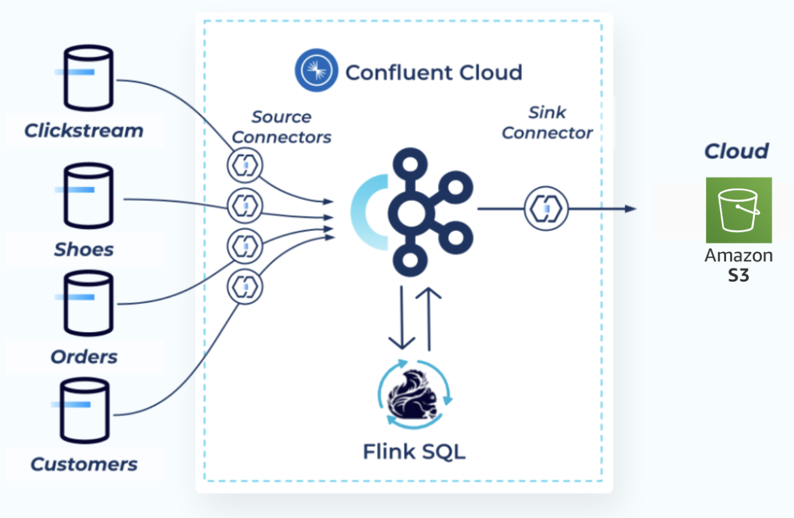
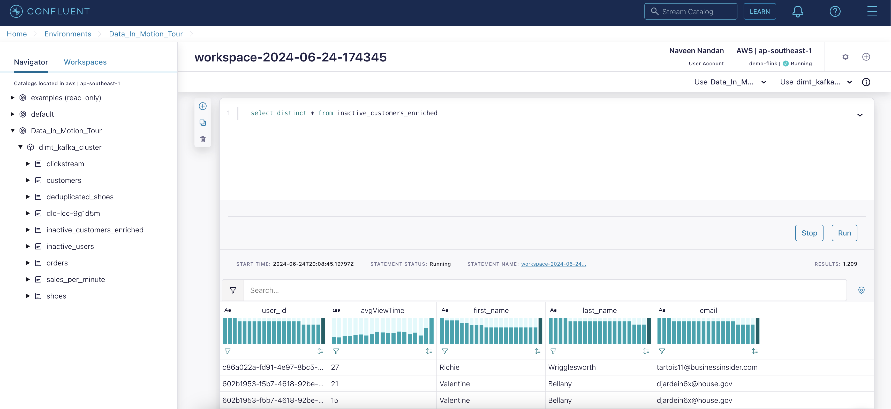
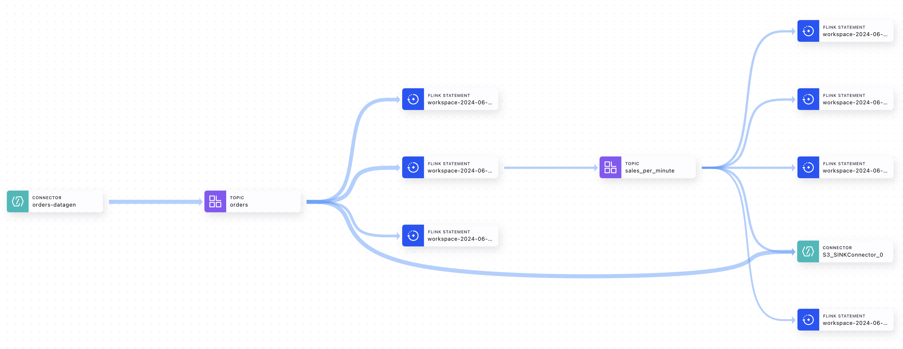

# Build end-to-end streaming data pipelines fast
(This workshop is based on the original - https://github.com/confluentinc/live-labs/tree/master/DIMT2024)

Welcome to HappyFeet store - Where Every Step Matters! In this workshop, we harness the power of customer data, clickstreams, and order information to identify customers who spend minimal time on our website. Our goal is to launch a targeted marketing campaign that re-engages these customers, ensuring that every second they spend on our website is worthwhile. Join us in this journey to provide a personalized and memorable shopping experience at HappyFeet, where style, comfort, and exceptional customer service converge.

<div align="center"> 
  
</div>

---

# Requirements

In order to successfully complete this demo you need to install few tools before getting started.

- If you don't have a Confluent Cloud account, sign up for a free trial [here](https://www.confluent.io/confluent-cloud/tryfree/?utm_campaign=tm.fm-apac_cd.2024.Q2_APAC_PARENT_Data-in-Motion-Tour-APAC).
- Install Confluent Cloud CLI by following the instructions [here](https://docs.confluent.io/confluent-cli/current/install.html).
- Download and Install Terraform [here](https://developer.hashicorp.com/terraform/install)

  > **Note:** This workshop was tested on a Mac (M1).

## Setup

1. This demo uses Terraform and bash scripting to create and teardown infrastructure and resources.

1. Clone and enter this repository.

   ```bash
   git clone https://github.com/nav-nandan/DIMT-SG-2024.git
   cd DIMT-SG-2024
   ```

### Confluent Cloud

Create Confluent Cloud API keys by following [this](https://registry.terraform.io/providers/confluentinc/confluent/latest/docs/guides/sample-project#create-a-cloud-api-key) guide.

> **Note:** This is different than Kafka cluster API keys.


### Build your cloud infrastructure

1. Navigate to the repo's terraform directory.

   ```bash
   cd DIMT2024/terraform
   ```

1. Initialize Terraform within the directory.
   ```bash
   terraform init
   ```
1. Create the Terraform plan.
   ```bash
   terraform plan
   ```
1. Apply the plan to create the infrastructure. You can run `terraform apply -auto-approve` to bypass the approval prompt.

   ```bash
   terraform apply
   ```

   > **Note:** Read the `main.tf` configuration file [to see what will be created](./terraform/main.tf).

<details>
    <summary><b>Confluent Cloud Web UI</b></summary>

1. Log into Confluent Cloud by navigating to confluent.io and click on the **Login** on the top right corner.
1. Step into **Data_In_Motion_Tour** environment.
1. Step into **dimt_kafka_cluster**.
1. On the navigation menu, select **Connectors** and then **+ Add connector**.
1. In the search bar search for **Sample Data** and select the **Sample Data** which is a fully-managed connector.
1. Create 4 new connectors using values in `main.tf` datagen source connector section.

</details>
<br>

Once all connectors are fully provisioned, check for and troubleshoot any failures that occur. Properly configured, each connector begins reading data automatically.

## Process and Enrich Data Streams with Flink SQL

Now that you have data flowing through Confluent, you can now easily build stream processing applications using Flink SQL. You are able to continuously transform, enrich, join, and aggregate your data using SQL syntax. You can gain value from your data directly from Confluent in real-time. Also, Confluent Cloud for Flink provides a truly cloud-native experience for Flink. You don’t need to know about or interact with Flink clusters, state backends, checkpointing, and all of the other aspects that are usually involved when operating a production-ready Flink deployment.

If you’re interested in learning more about Flink, you can take the Apache Flink 101 course on Confluent Developer [website](https://developer.confluent.io/courses/apache-flink/intro/).

1.  Log into Confluent Cloud web UI, then click on **Data_In_Motion_Tour** environment.
1.  Click on **Flink (preview)** and then **Open SQL workspace**.
1.  On the top right corner of your workspace select **Data_In_Motion_Tour** as the catalog and **dimt_kafka_cluster** as your database.

    > **Note:** Refer to the [docs](https://docs.confluent.io/cloud/current/flink/index.html#metadata-mapping-between-ak-cluster-topics-schemas-and-af) to understand the mapping between Kafka and Flink.

1.  On the left-hand side under **Navigator** menu, click the arrow to expand the **Data_In_Motion_Tour** Kafka environment, and expand the **dimt_kafka_cluster** to see existing Kafka topics.

1.  You will use the code editor to query existing Flink tables (Kafka topics) and to write new queries.

1.  To write a new query, click on the **+** icon to create a new cell.

1.  See how `orders` table was created
    ```sql
    SHOW CREATE TABLE orders;
    ```
1.  Explore the `orders` table

    ```sql
    SELECT * FROM orders;
    ```

1.  Create a table to count the unique purchases per minute. In a real world scenario an hourly window is probably more appropriate, but for the purpose of this lab we'll use minute.

    ```sql
    CREATE TABLE sales_per_minute (
        window_start TIMESTAMP(3),
        window_end   TIMESTAMP(3),
        nr_of_orders BIGINT
    );
    ```

1.  Confluent Cloud introduces the concept of system columns. You will use the `SYSTEM` column `$rowtime` for `DESCRIPTOR` parameter when performing windowed aggregations with Flink SQL in Confluent Cloud. Otherwise you can define your own `WATERMARK` [strategy](https://docs.confluent.io/cloud/current/flink/concepts/timely-stream-processing.html#time-and-watermarks-in-af) when creating new tables. [Tumbling windows](https://docs.confluent.io/cloud/current/flink/reference/queries/window-tvf.html#tumble) is a table-valued function (TVF) for dividing data into non-overlapping, fixed-size windows. This is useful when you want to analyze data in discrete time intervals. Now you can materialize number of unique purchase per minute in the newly created topic.

    ```sql
    INSERT INTO sales_per_minute
        SELECT window_start, window_end, COUNT(DISTINCT order_id) as nr_of_orders
        FROM TABLE(
            TUMBLE(TABLE orders, DESCRIPTOR(`$rowtime`), INTERVAL '1' MINUTE))
        GROUP BY window_start, window_end;
    ```

1.  Query the `sales_per_minute` table and review the data

    ```sql
    SELECT * FROM sales_per_minute;
    ```

1.  Let's see how many records we have in the `shoes` table with the `id = '3586de8a-10a3-4997-96bf-9e08a3a7fb82'`. The connector generates random events which results in duplicated `id`. Since there are more than 1 records, you need to deduplicate the table.

    ```sql
    SELECT * FROM shoes WHERE id = '3586de8a-10a3-4997-96bf-9e08a3a7fb82';
    ```

1.  [Deduplication](https://docs.confluent.io/cloud/current/flink/reference/queries/deduplication.html) removes duplicate rows over a set of columns, keeping only the first or last row. Flink SQL uses the `ROW_NUMBER()` function to remove duplicates, similar to its usage in [Top-N Queries](https://docs.confluent.io/cloud/current/flink/reference/queries/topn.html#flink-sql-top-n). Deduplication is a special case of the Top-N query, in which `N` is `1` and row order is by processing time or event time. In some cases, an upstream ETL job isn’t end-to-end exactly-once, which may cause duplicate records in the sink, in case of failover. Duplicate records affect the correctness of downstream analytical jobs, like `SUM` and `COUNT`, so deduplication is required before further analysis can continue.

    ```sql
    SELECT id, name, brand
    FROM (
        SELECT *,
            ROW_NUMBER() OVER (PARTITION BY id ORDER BY $rowtime DESC) AS row_num
        FROM `shoes`)
    WHERE row_num = 1
    ```

    Let's take a look at different parts of the above query:

    - `ROW_NUMBER()` starting at one, this assigns a unique, sequential number to each row
    - `PARTITION BY` specifies how to partition the data for deduplication. This should be the column(s) which will only have one row per value after deduplication. In this case it's column `id`
    - `ORDER BY` orders by the provided column and it’s required to be a time attribute. The time attribute column can be processing time (system time of the machine running the Flink job) or event time. By default `ORDER BY` puts rows in ascending (`ASC`) order. By using `ASC` order you’ll keep the first row. Should you want to keep the last row you should use `ORDER BY <time_attribute> DESC`. Refer to [this](https://developer.confluent.io/tutorials/finding-distinct-events/flinksql.html) tutorial to learn more deduplication with Flink SQL.

1.  Since the output of the transient query looks right, the next step is to make the query persistent. This looks exactly like the transient query, except you first create a new table and then execute an `INSERT INTO` statement to populate the table. The `INSERT INTO` statement returns to the CLI prompt right away, having created a persistent stream processing program running in the Flink cluster, continuously processing input records and updating the resulting `deduplicated_shoes` table. A primary key constraint is a hint for Flink SQL to leverage for optimizations which specifies that a column or a set of columns in a table or a view are unique and they do not contain null. No columns in a primary key can be nullable. A primary key uniquely identifies a row in a table.

    ```sql
    CREATE TABLE deduplicated_shoes(
        id STRING,
        brand STRING,
        name STRING,
        sale_price INT,
        rating DOUBLE,
        PRIMARY KEY (id) NOT ENFORCED
    );

    INSERT INTO deduplicated_shoes(
        SELECT id, brand, name, sale_price, rating
        FROM (
            SELECT *,
                ROW_NUMBER() OVER (PARTITION BY id ORDER BY $rowtime DESC) AS row_num
            FROM `shoes`)
        WHERE row_num = 1
    );
    ```

1.  Now that you have `deduplicated_shoes` table you can join it with `clickstream`.

    ```sql
    SELECT
        c.`$rowtime`,
        c.product_id,
        s.name,
        s.brand
    FROM
        clickstream c
        INNER JOIN deduplicated_shoes s ON c.product_id = s.id;
    ```

1.  Create a table to find all users with average view time of less then 30 seconds. You'll achieve this by using Pattern Recognition. Refer to the [doc](https://docs.confluent.io/cloud/current/flink/reference/queries/match_recognize.html) for detailed information about Pattern Recoginition and how `MATCH_RECOGNIZE` works.

    ```sql
    CREATE TABLE inactive_users(
        user_id STRING,
        start_tstamp TIMESTAMP(3),
        end_tstamp TIMESTAMP(3),
        avgViewTime INT
    );

    INSERT INTO inactive_users
    SELECT *
    FROM clickstream
        MATCH_RECOGNIZE (
            PARTITION BY user_id
            ORDER BY `$rowtime`
            MEASURES
                FIRST(A.`$rowtime`) AS start_tstamp,
                LAST(A.`$rowtime`) AS end_tstamp,
                AVG(A.view_time) AS avgViewTime
            ONE ROW PER MATCH
            AFTER MATCH SKIP PAST LAST ROW
            PATTERN (A+ B)
            DEFINE
                A AS AVG(A.view_time) < 30
        ) MR;
    ```

1.  Now that you have a table of users who spend less than 30 seconds on the website, you can join it with `customers` table to retrive their contact information. Then you can stream this data in real time to S3 from where your marketing department can use this data to build a new campaign.
    ```sql
    CREATE TABLE inactive_customers_enriched(
        user_id STRING,
        avgViewTime INT,
        first_name STRING,
        last_name STRING,
        email STRING
    );
    INSERT INTO inactive_customers_enriched
    	SELECT
    		u.user_id,
    		u.avgViewTime,
    		c.first_name,
    		c.last_name,
    		c.email
    	FROM
    		inactive_users u
    		INNER JOIN customers c ON u.user_id = c.id;
    SELECT DISTINCT * FROM inactive_customers_enriched;
    ```

    <div align="center">
      
    </div>

---

## Connect S3 to Confluent Cloud

You can create the S3 Sink connector through the Confluent Cloud web UI.

<details>
    <summary><b>Confluent Cloud Web UI</b></summary>

1. On the navigation menu, select **Connectors** and **+ Add connector**.
1. In the search bar search for **S3** and select the **S3 Sink** which is a fully-managed connector.
1. Create a new S3 Sink connector and complete the required fields such as AWS access key, secret and S3 bucket name.

</details>
<br>

Once the connector is in **Running** state navigate to **Amazon S3 → Buckets → 2024dimtsg → topics** and verify messages are showing up correctly.

Refer to our [documentation](https://docs.confluent.io/cloud/current/connectors/cc-s3-sink/cc-s3-sink.html) for detailed instructions about this connector.

---

## CONGRATULATIONS

Congratulations on building your streaming data pipelines in Confluent Cloud! Your complete pipeline can be viewed via Stream Lineage.

   <div align="center"> 
      
   </div>

---

# Teardown

1. Delete the S3 Sink connector via the Web UI

1. Run the following command to delete the remaining Confluent Cloud resources

   ```bash
   cd DIMT2024/terraform
   terraform destroy
   ```

# Resources

1. Flink SQL [docs](https://docs.confluent.io/cloud/current/flink/index.html)
1. Apache Flink 101 developer [course](https://developer.confluent.io/courses/apache-flink/intro/)
1. Building Apache Flink applications in Java developer [course](https://developer.confluent.io/courses/flink-java/overview/)
1. Confluent Cloud - Flink SQL shoe store workshop GitHub [repo](https://github.com/griga23/shoe-store)
1. Stream Processing Simplified blog [series](https://www.confluent.io/blog/apache-flink-for-stream-processing/)
1. Experience serverless stream processing with Confluent Cloud for Apache Flink [webinar](https://www.confluent.io/resources/online-talk/apache-flink-on-confluent-cloud/)
